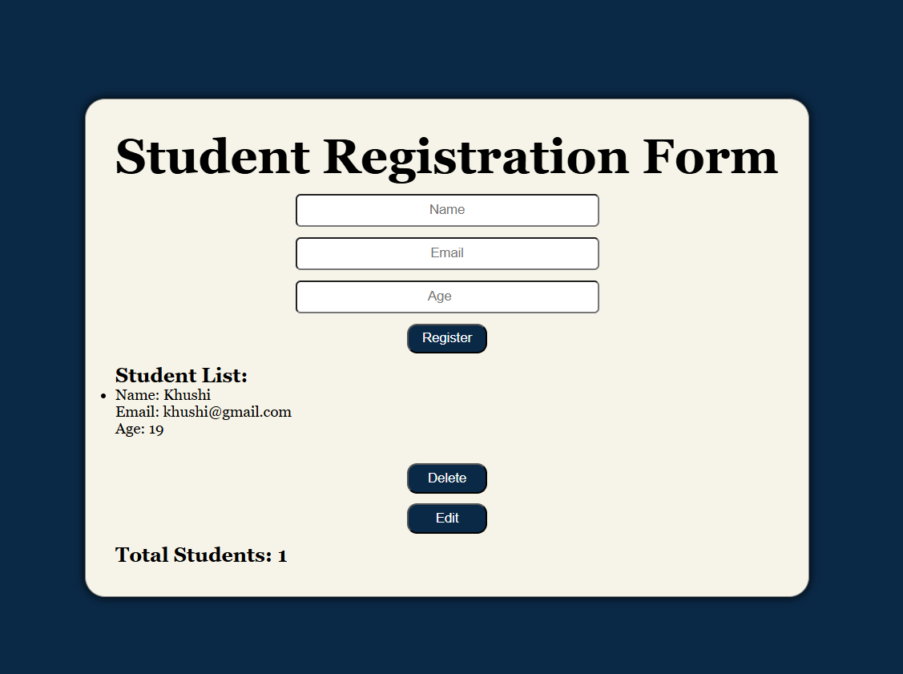
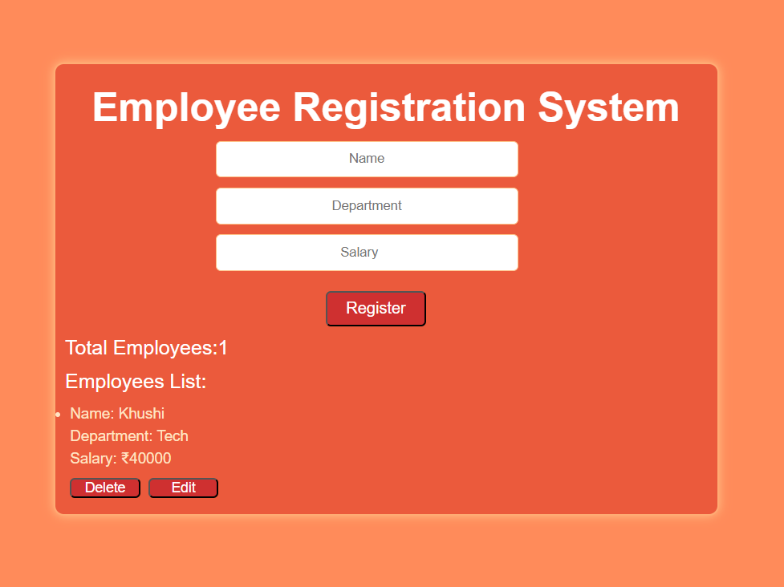

JavaScript Tasks : This repository contains my javaScript practice tasks.
## TASKS ##
Task 1 - JavaScript Basics 
        -Variables
        -Functions
        -Event Handling
Task 2 - Notes App
        -Creates notes
        -HTML,CSS & javaScript
Task 3 - Shopping List App
         -Add Items
         -Simple DOM Manipulation
         -Event Handling
  ## Screenshot 
  
Task 4 - Student Marks Calculator
        -Enter marks of subjects
        -Calculate Total Marks
        -Calculate Percentage
        -Display Result
        -Grade Calculation
 ## Screenshot
  

Task 5 -Student Registration Form
       -User Registration Form
       -Delete , edit and update button
       -Form validation
       -Responsive design
 ## Screenshot
 

 Task 6 -Employee Registration System
        -Employee Registration Form
        -HTML,CSS & JavaScript
        -Collects employees details
        -Responsive Design
## Screenshot

Task 7 -Pizza Order System
       -Pizza Order Form
       -HTML,CSS & JavaScript 
       -Add pizza orders
       -Delete and Edit order
       -Search Bar 
       -Responsive Design
## Screenshot 

   Technologies Used: -HTML
                   -CSS
                   -JavaScript
Author: Khushi 
