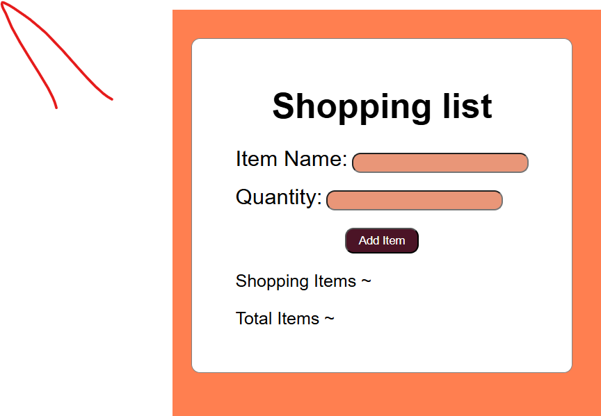
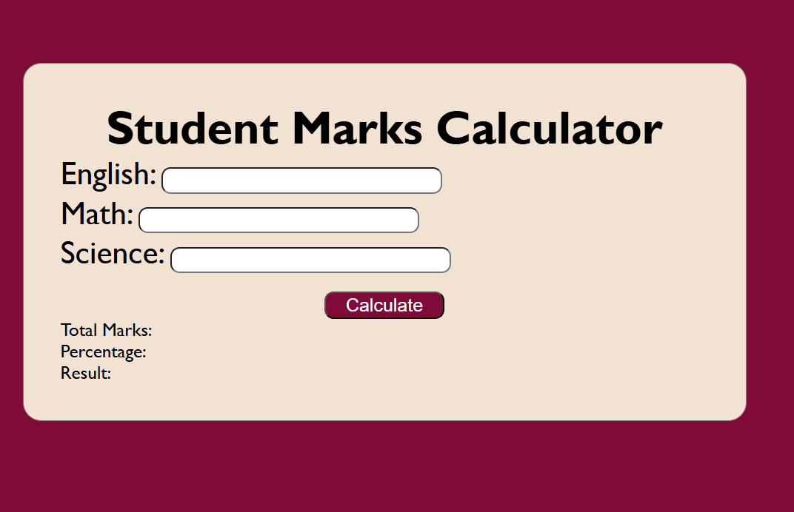

JavaScript Tasks : This repository contains my javaScript practice tasks.
## TASKS ##
Task 1 - JavaScript Basics 
        ~Variables
        ~Functions
        ~Event Handling
Task 2 - Notes App
        ~Creates notes
        ~HTML,CSS & javaScript
Task 3 - Shopping List App
         ~Add Items
         ~Simple DOM Manipulation
         ~Event Handling
  ## Screenshot 
         
Task 4 - Student Marks Calculator
        ~Enter marks of subjects
        ~Calculate Total Marks
        ~Calculate Percentage
        ~Display Result
        ~Grade Calculation
 ## Screenshot
  
  
  Technologies Used: -HTML
                   -CSS
                   -JavaScript
Author: Khushi 
