JavaScript Tasks : This repository contains my javaScript practice tasks.
## TASKS ##
## Task 1 - JavaScript Basics 
        -Variables
        -Functions
        -Event Handling
## Task 2 - Notes App
        -Creates notes
        -HTML,CSS & javaScript
## Task 3 - Shopping List App
         -Add Items
         -Simple DOM Manipulation
         -Event Handling
  ## Screenshot 
  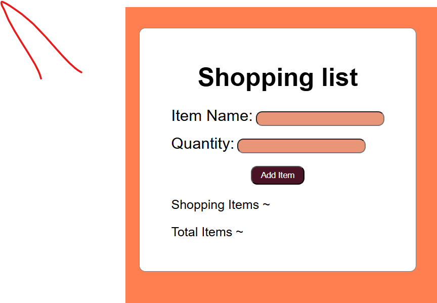
## Task 4 - Student Marks Calculator
        -Enter marks of subjects
        -Calculate Total Marks
        -Calculate Percentage
        -Display Result
        -Grade Calculation
 ## Screenshot
  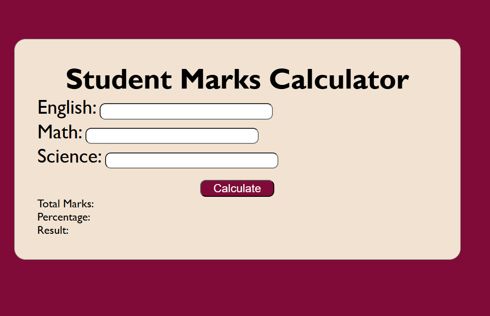

## Task 5 -Student Registration Form
       -User Registration Form
       -Delete , edit and update button
       -Form validation
       -Responsive design
 ## Screenshot
 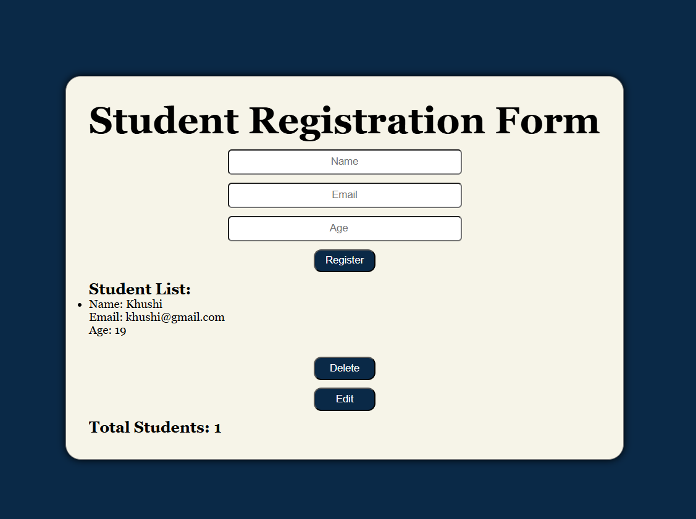

 ## Task 6 -Employee Registration System
        -Employee Registration Form
        -HTML,CSS & JavaScript
        -Collects employees details
        -Responsive Design
## Screenshot
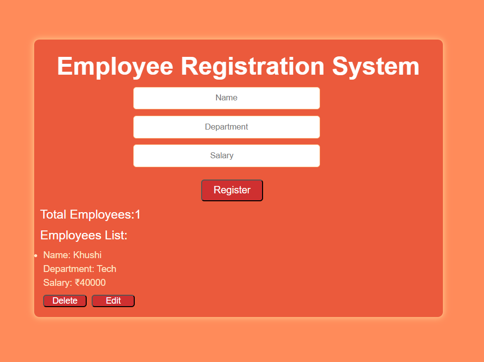
## Task 7 -Pizza Order System
       -Pizza Order Form
       -HTML,CSS & JavaScript 
       -Add pizza orders
       -Delete and Edit order
       -Search Bar 
       -Responsive Design
## Screenshot 
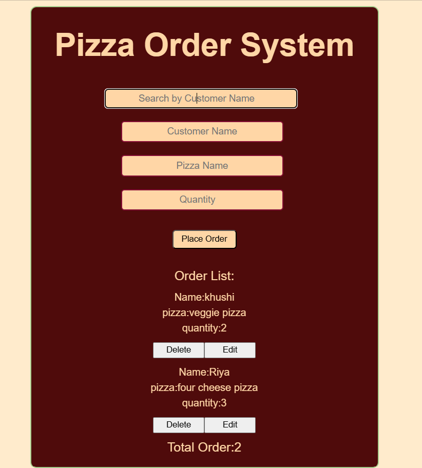

## Task 8 -Live Search Filter
       -HTML, CSS, JavaScript
       -Search items in real time
       -Used JavaScript `filter()` method
       -Responsive Design
## Screenshot
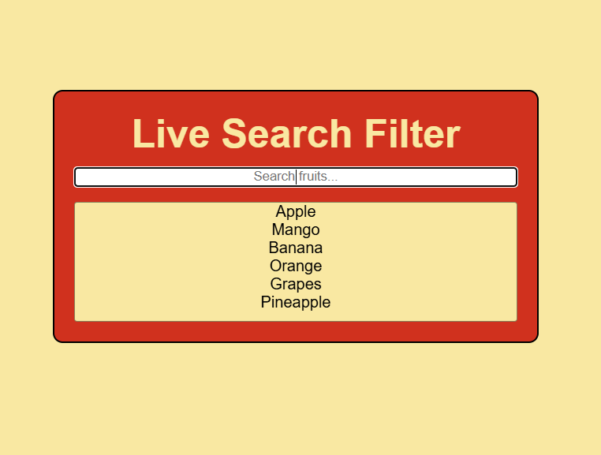

## Task 9 -Random Joke Generator
       -Generates random jokes using JavaScript
       -Fetches jokes from an API
       -Displays a new joke on button click
       -Simple and Responsive UI
       -HTML, CSS ,JavaScript
## Screenshot
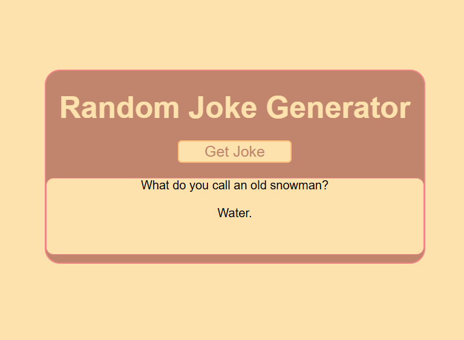

## Task 10 -Quote Generator
        -Generates random inspirational quotes
        -Displays a new quote with a single button click
        -Build using HTML, CSS, JavaScript
        -Clean and Responsive UI
## Screenshot
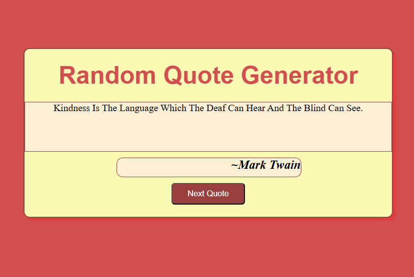

## Task 11 -Weather App
        -Displays real-time weather information
        -Search weather by city name
        -Uses openWeather API
        -Responsive Design
        -Built with HTML, CSS ,JavaScript
## Screenshot 
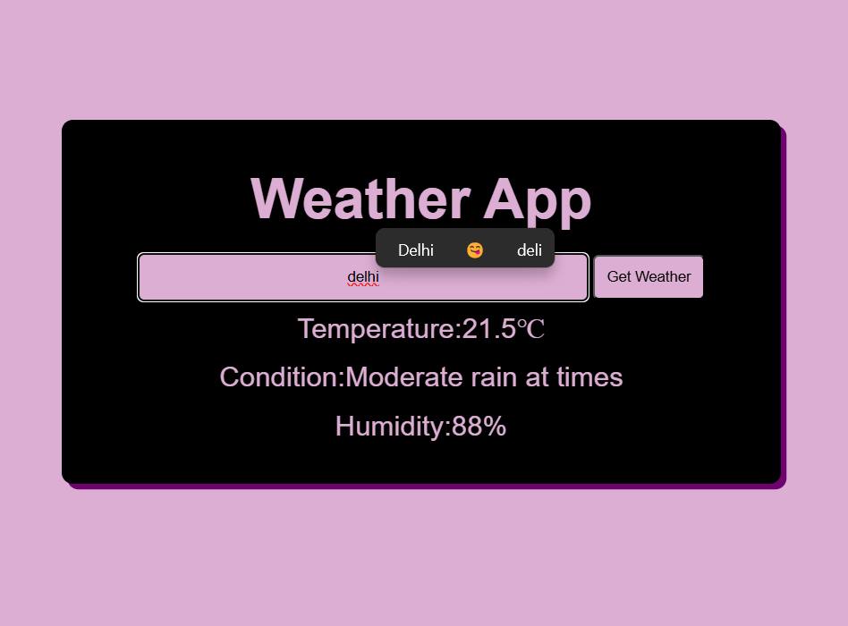
## Technologies USed
-HTML
-CSS
-JavaScript
-OpenWeather API
### Setup Instructions
1. Get your free API key from https://openweathermap.org/api
2. Open `weather.js` .
3. Replace:
```javascript
const apikey ="YOUR_API_KEY";
```
4. Save the file and run the project.

## Task-12 -Quiz App
        -Interactive Quiz Applications
        -Multiple-choice questions
        -Instant score calculation
        -Next question functionality
        -Responsive Design
        -Built with HTML,CSS & JavaScript
## Screenshot
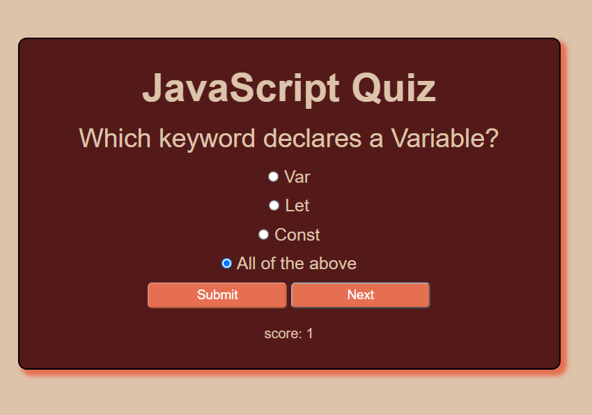

## Task-13 -Dictionary App
        -Search the meaning of the English words
        -Displays word definition, pronunciation, apart of speech and example.
        -Uses Dictionary API
        -Clean and Responsive UI
        -Built with HTML, CSS and JavaScript
## Screenshot 
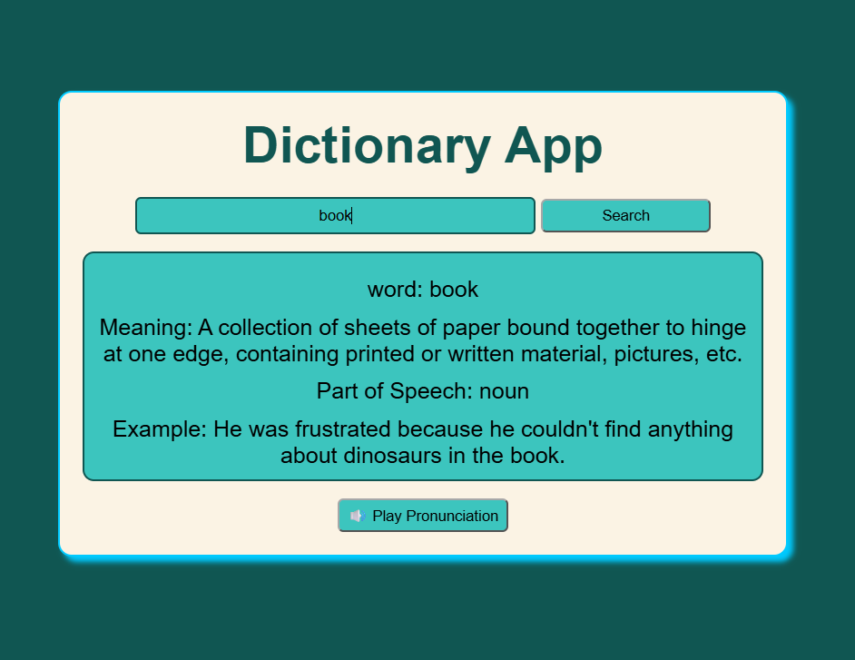

### Setup Instructions
This project uses the **Free Dictionary API** , So no API key is required. Simply open the project in your browser and start searching for words.

Task-14 -Movie Search App
        -Search movies by title
        -HTML,CSS & JavaScript
        -Uses movie API to fetch movie details
        -Displays movie poster, title, release year and rating
        -Responsive Design
## Screenshot
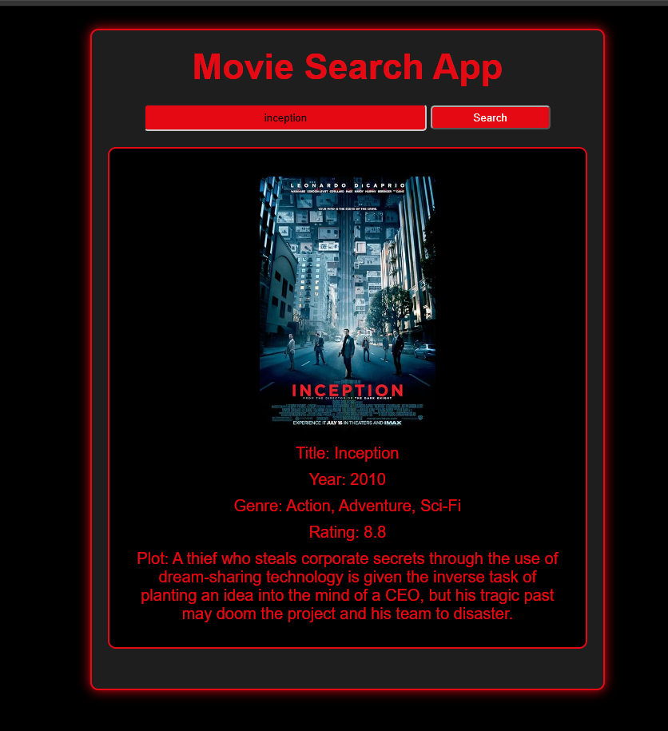
> **NOTE** Project uses a Movie API to run it locally, replace 'YOUR_API_KEY' in the JavaScript file with your own API key.
### Setup Instruction
1. Clone this repository.
2. Open the project folder.
3. Get your free API key from the respective API provider.
4. Open the JavaScript file.
5. Replace: "YOUR_API_KEY" with "YOUR_API_KEY";
6. Save the file.
7. open `index.html` in your browser.

## Task-15 -Music Player App
        -Search for songs by title or artist
        -Displays song information
        -Music player interface
        -HTML, CSS & JavaScript
        -Responsive Design
## Screenshot
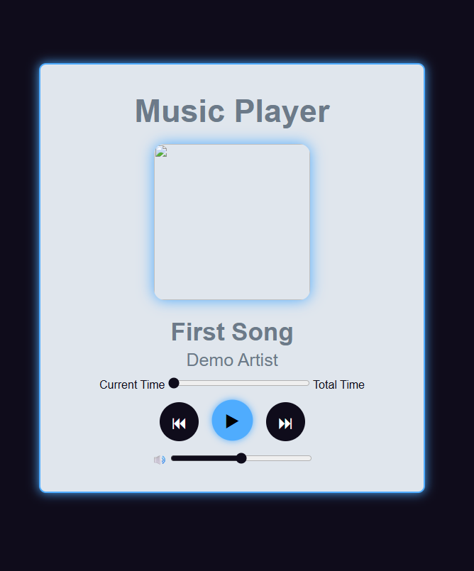
### Setup Instructions
This project is a front-end music player application. Sample music data and media assets are not included in the repository.
To use the app with your own data:
1. Add the required song data in the JavaScript file.
2. Add the song name and artist name.
3. Add the cover image for each song.
4. add the corresponding audio file.
5. Update the file paths in the JavaScript/data section.
6. Open `index.html` in your browser.
### Required Data
Each song should contain:
-Song Name
-Artist Name
-Cover Image
-Audio File
> **Note:** Add only audio, images, and other media that you have permission to use. Do not upload copyrighted songs to a public repository without permission.

## Task-16 -Expense Tracker App
           -Add and track daily expenses
           -Enter expenses name and amount
           -Displays expenses records
           -Calculate total expenses
           -Delete expenses
           -Simple and responsive interface
           -Built with HTML, CSS & JavaScript
## Screenshot
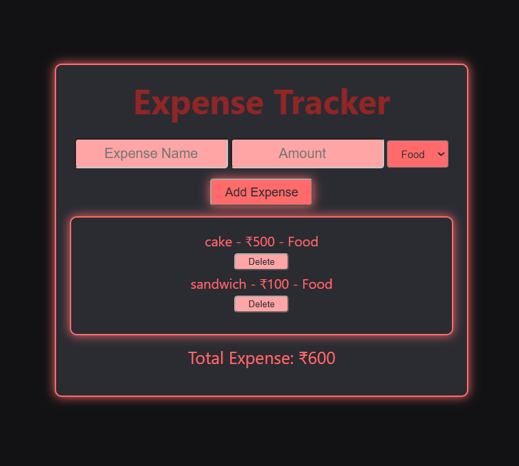

## Task-17 -Recipe Finder App
           -Search recipe by name
           -Displays recipe details
           -Shows ingredients and cooking instructions
           -Uses JavaScript to fetch and displays recipe data
           -Responsive Designs
           -Built with HTML, CSS and JavaScript
## Screenshot
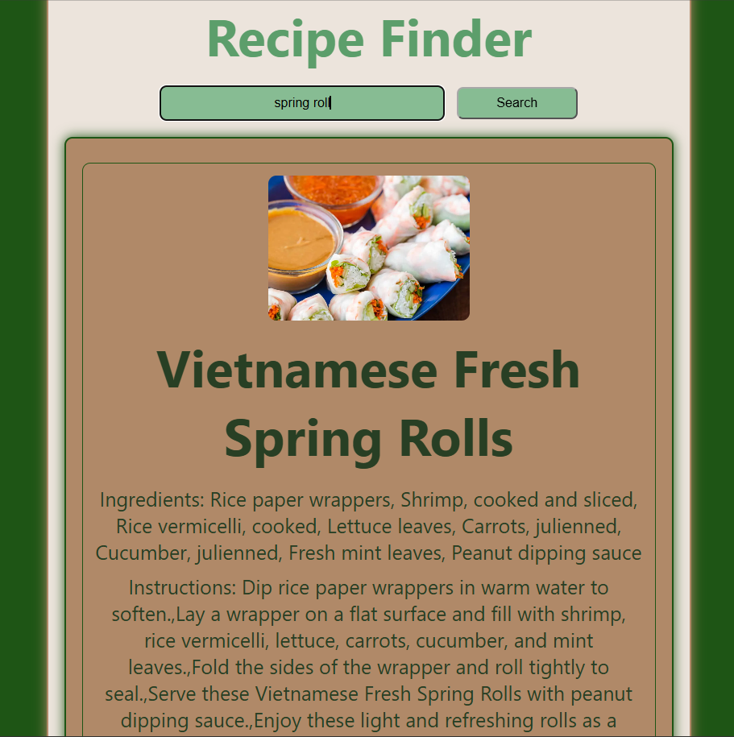

**Technologies Used:** 
 -HTML
 -CSS
 -JavaScript
 
**Author:** Khushi 
